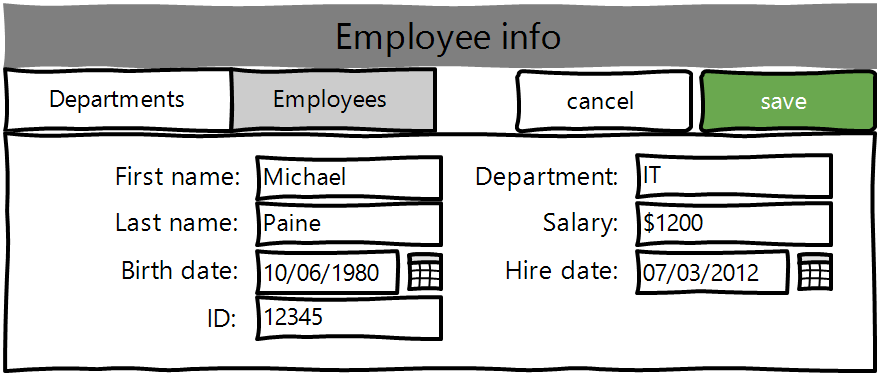

# Departments manager
## Vision
“Departments manager” is web-application which allows users to record information  about departments and employees.  
Application should provide:
-	Storing departments and employees in a database; 
-	Display list of employees; 
-	Updating the list of employees (adding, editing, removing); 
-	Display list of departments; 
-	Updating the list of departments (adding, editing, removing);
-	Display department info; 
-	Updating department (editing, removing);
-	Display employee info; 
-	Updating employee (editing, removing);
-	Display number of employees in departments; 
-	Display average salary in departments; 
-	Display birth date and date of hire for employees;
-	Display salary for employees;
-	Filtering by salary, department, birth date and date of hire for employees;
-	Filtering by number of employees and average salary for departments.

##1. Departments
###1.1 Display list of departments
The mode is designed to view the list of departments, possibly filter it by salary  and number of employees.

_**Main scenario:**_
-	User selects item ”Departments”;
-	Application displays list of departments.  

  
######_Pic. 1.1.1 View the Departments list._  

The list displays the following columns:
-	Unique department name;
-	Department head`s name;
-	Number of employees;
-	Average salary – Mean value calculated as sum of department employees` salaries divided by number of employees.  

**Filtering by number of employees and/or average salary:**
-	In the departments view mode user clicks on filter button, in opened filter menu sets desired filter values and presses “OK” button;
-	The application will display a form to view the list of Departments with updated data;
-	User presses cancel button and then application hides filter menu.  

  
######_Pic. 1.1.2 View of Departments list with applied filter by employees_

###1.2 Add department
_**Main scenario:**_
-	User clicks the “Add” button in the departments list view mode;
-	Application displays form to enter department data;
-	User enters department info and presses “Save” button;
-	If any data is entered incorrectly, incorrect data messages are displayed; 
-	If entered data is valid, then record is adding to database; 
-	If error occurs, then error message is displaying; 
-	If new order record was successfully added, then list of employees with added records will be displayed.  

_**Cancel operation scenario:**_
-	User clicks the “Add” button in the departments list view mode;
-	Application displays form to enter department data;
-	User enters department data (optionally) and then presses “Cancel” button
-	Data is not saved in the database, and then list of departments is displayed to user. 
-	If the user selects the menu item “Departments”, or "Employees", the data will not be saved in the database and the corresponding form with updated data will be opened.

  
######_Pic. 1.2 Add department view_ 

###1.3 Show department info
_**Main scenario:**_
-	User clicks the department name field for one of the departments in the departments list view mode;
-	Application displays department info page;
-	If error occurs, then error message is displaying; 

  
######_Pic. 1.3 Department info view_ 

###1.4 Edit department
_**Main scenario:**_
-	User clicks the “edit” button for one of the department in the departments list view mode or in department info page mode;
-	Application displays department info page;
-	User edits department info and then presses “save” button
-	If any data is entered incorrectly, incorrect data messages are displayed; 
-	If entered data is valid, then updated record is adding to database; 
-	If error occurs, then error message is displaying; 
-	If new order record is successfully added, then department info with updated records is displayed.

_**Cancel operation scenario:**_
-	User clicks the “edit” button for one of the department in the departments list view mode;
-	Application displays department info form in edit mode;
-	User edits department info (optionally) and then presses “cancel” button;
-	Data is not saved in the database, and then list of departments will is displayed to user. 
-	If the user selects the menu item “Departments”, or "Employees", the data will not be saved in the database and the corresponding form with updated data will be opened.

  
######_Pic. 1.4 Edit department view_ 

###1.5 Delete department
_**Main scenario:**_
-	The user, while in the list of departments, presses the "Delete" button in the selected department line;
-	Confirmation dialog is displayed; 
-	The user confirms the removal of the department; 
-	Record is deleted from database; 
-	If department had some employees in it, their department is set to “Unspecified” and salary is set to zero;
-	If error occurs, then error message displays;
-	If order record is successfully deleted, then list of orders without deleted records is displaying.

  
######_Pic. 1.5 Delete department view_ 

_**Cancel operation scenario:**_
-	The user, while in the list of departments, presses the "Delete" button in the selected department line;
-	Confirmation dialog is displayed; 
-	The user presses “cancel” button; 
-	Departments list without changes is displaying.

##2. Employees
###2.1 Display list of employees
The mode is designed to view the list of employees, possibly filter it by salary, department, dates of birth and/or hire.

_**Main scenario:**_
-	User selects item ”Employees”;
-	Application displays list of employees.

  
######_Pic. 2.1.1 View the Employees list._

The list displays the following columns:
-	Unique employee ID;
-	First name;
-	Last name;
-	Department name;
-	Salary;
-	Birth date;
-	Hire date;

**Filtering by number of employees and/or average salary:**
-	In the employees view mode user clicks on filter button, in opened filter menu sets desired filter values and presses “OK” button;
-	The application will display a form to view the list of Employees with updated data;
-	User presses cancel button and then application hides filter menu.

  
######_Pic. 2.1.2 View of Employees list with applied filters by salaries, birth date and hire date_

###2.2 Add Employee
_**Main scenario:**_
-	User clicks the “Add” button in the employees list view mode;
-	Application displays form to enter employee data;
-	User enters employee data and presses “save” button;
-	If any data is entered incorrectly, incorrect data messages are displayed; 
-	If entered data is valid, then record is adding to database; 
-	If error occurs, then error message is displaying; 
-	If new order record was successfully added, then list of departments with added records will be displayed.

_**Cancel operation scenario:**_
-	User clicks the “Add” button in the departments list view mode;
-	Application displays form to enter department data;
-	User enters department data (optionally) and presses “Cancel” button
-	Data is not saved in the database, and then list of employees is displayed to user. 
-	If the user selects the menu item “Departments”, or "Employees", the data will not be saved in the database and the corresponding form with updated data will be opened.

  
######_Pic. 2.2 Add employee view_ 

###2.3 Show employee info
_**Main scenario:**_
-	User clicks the employee ID field for one of the employees in the departments list view mode;
-	Application displays employee info page;
-	If error occurs, then error message is displaying; 

  
######_Pic. 2.3 Employee info view_ 

###2.4 Edit employee
_**Main scenario:**_
-	User clicks the “edit” button for one of the employee in the employees list view mode or in department head field in departments list or department details mode;
-	Application displays employee info page;
-	User edits employee info and then presses “save” button;
-	If any data is entered incorrectly, incorrect data messages are displayed; 
-	If entered data is valid, then updated record is adding to database; 
-	If error occurs, then error message is displaying; 
-	If employee record is successfully updated, then employee info with updated records is displayed.

_**Cancel operation scenario:**_
-	User clicks the “edit” button for one of the department in the departments list view mode;
-	Application displays employee info form in edit mode;
-	User edits employee info (optionally) and then presses “cancel” button;
-	Data is not saved in the database, and employee info without changes will be displayed to user. 
-	If the user selects the menu item “Departments”, or "Employees", the data will not be saved in the database and the corresponding form with updated data will be opened.

  
######_Pic. 1.4 Edit employee view_ 

###2.5 Delete employee
_**Main scenario:**_
-	The user, while in the list of employees, presses the "Delete" button in the selected employee line;
-	Confirmation dialog is displayed; 
-	The user confirms the removal of the employee; 
-	Record is deleted from database; 
-	If Employee was head in some department, this department`s head field is set to “Unspecified”;
-	If error occurs, then error message displays;
-	If record is successfully deleted, then list of employees without deleted record is displaying.

  
######_Pic. 2.5 Delete employee view_ 

_**Cancel operation scenario:**_
-	The user, while in the list of employees, presses the "Delete" button in the selected department line;
-	Confirmation dialog is displayed; 
-	The user presses “cancel” button; 
-	Employees list without changes is displaying.

